# Projeto - Gerenciador de Tarefas

O objetivo desse projeto é criar uma aplicação para o gerenciamento de tarefas, onde uma tarefa pode ter nenhuma ou várias subtarefas. Deve permitir ao usuário criar, editar, excluir tarefas e subtarefas. As tarefas e subtarefas terão estados para pendente, andamento, concluída ou cancelada.

## Atenção antes de começar!!
Por favor, leia o documento até o fim. Todos os detalhes nesse documento são importantes para que possamos te avaliar da melhor forma possivel.

## 🚀 Desenvolvimento

O projeto deve ter duas interfaces para acesso, uma do Protheus e outra Web em PO-UI/THF (Smart UI). O acesso da interface do Protheus pode ser feito através de uma rotina de menu e o acesso da interface Web pode ser da mesma maneira ou por algum navegador homologado ( Chrome, Firefox, Edge, Opera ).

## Detalhamento:
Abaixo você terá os detalhes de cada parte do projeto, atente-se aos detalhes visto que isso será o minimo que esperamos na entrega.

### Banco de dados:
  Abaixo damos a estrutura do dicionário das tabelas, implemente como conseguir.
  
#### Tabela - Tarefas: 

  - X2_UNICO: Filial + Código

#### Colunas
  - **ZZG_CODIGO** - Código ( Numeração Automática )
  - **ZZG_TITULO** - Titulo ( 50 Caracteres ) - Obrigatório
  - **ZZG_DESCRI** - Descrição ( Memo ) - Obrigatório
  - **ZZG_SITUAC** - Situação ( Opções: 1=Pendente, 2=Andamento, 3=Concluida, 4=Cancelada) - Obrigatório
  - **ZZG_USUINC** - Usuário de Inclusão ( __cUserId ) - Obrigatório
  - **ZZG_DTCONC** - Data de Inclusão - Obrigatório
  - **ZZG_DTINC**  - Data de Conclusão ( Date )

#### Tabela - SubTarefas 
  - ZZH X2_UNICO: Filial + Código SubTarefa

#### Colunas 
  - **ZZH_CODTAR** - Código Tarefa ( FK da Tarefa )
  - **ZZH_CODIGO** - Código ( Numeração Automática )
  - **ZZH_DESCRI** - Descrição ( 50 Caracteres) - Obrigatório
  - **ZZH_RESPON** - Responsável (*Campo Livre - 50 Caracteres*) - Obrigatório
  - **ZZH_STATUS** - Status (*CBOX - 1 Caracter - 1=Pendente;2=Andamento;3=Concluida;4=Cancelada*) - Obrigatório
  - **ZZH_DTCONC** - Data Conclusão
  

### ADVPL - MVC:
  A rotina deve funcionar tanto via FWMODEL ( REST ) quanto por dentro do Protheus, então na validação do projeto será avaliada a lógica do fonte MVC.

  - MenuDef
  - ViewDef
  - ModelDef

  Validações:
  - As tarefas devem ter uma coluna de Status e não pode permitir inputar valores invalidos;
  - Se todas as Subtarefas forem Concluídas -> Alterar a Situação da Tarefa para "Concluída";
  - O Cancelamento da Tarefa pode ocorrer a qualquer momento, mas a Conclusão precisa ser validada com as SubTarefas, não se pode concluir a tarefa se houver SubTarefa Pendente;
  - Data de Conclusão não pode ser Menor do que a Data de Inclusão;

### 📋 Exemplo da interface no Protheus

- Menu

  - 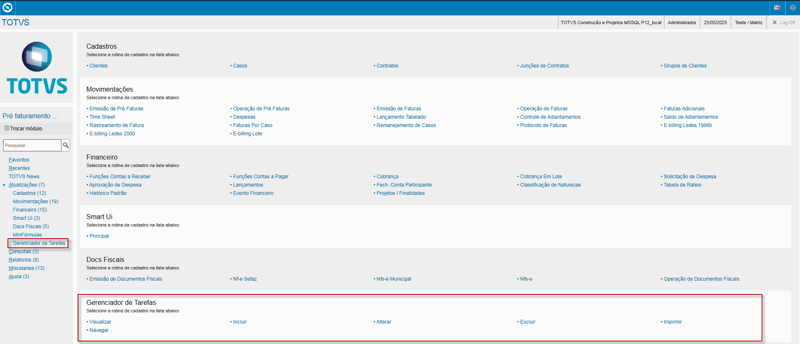

- Browse da rotina

  - 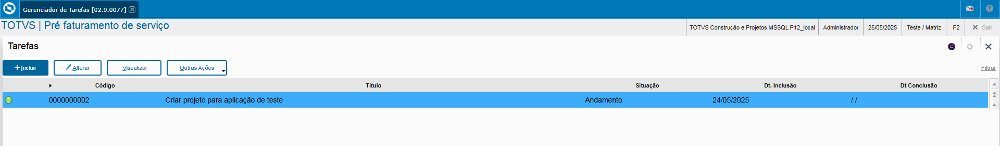

- Operação de Incluir

  - 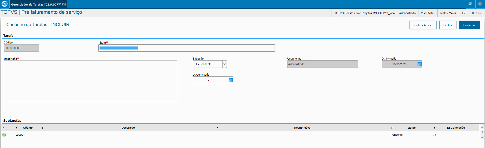

- Operação de Editar
  - 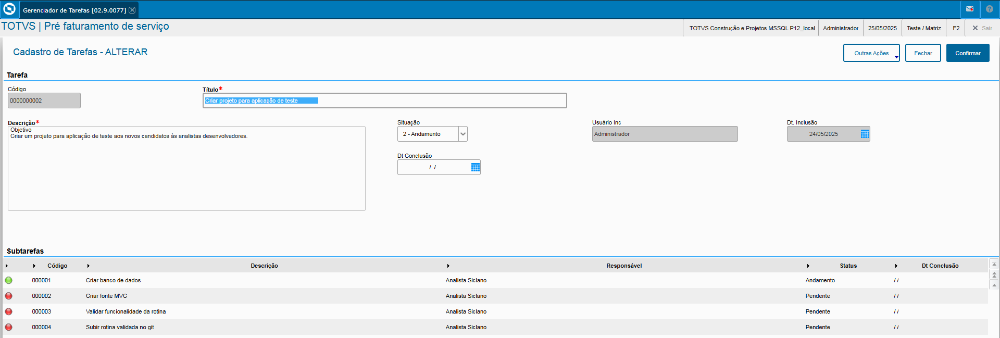

### Interface - Smart-UI ( PO-UI/THF )
Na Interface Web solicitamos que crie uma tela para visualização de todas as tarefas, onde o usuário poderá filtrar pelo Título ou Descrição da Tarefa. E tambem deverá ter uma opção para Inclusão de novas tarefas, alteração na linha e exclusão da tarefa. 
Todas as operações devem se comunicar com o Protheus via API REST ( FWModel ). 

### 📋 Exemplo da interface no POUI/THF (Smart UI).

- Browse da rotina

  - 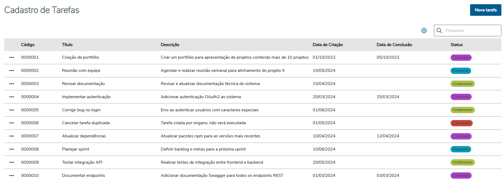

- Operação de Incluir

  - 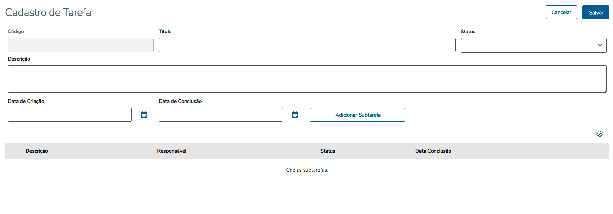

- Operação de Editar - Tarefa
  - 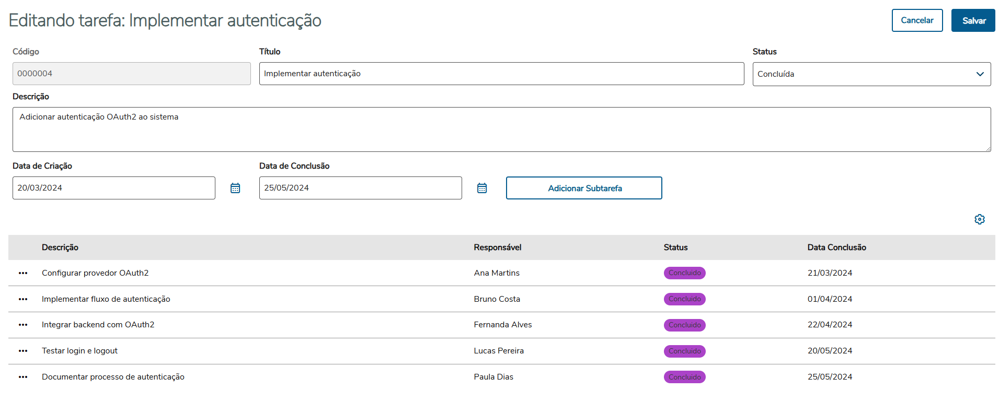

- Operação de Exclusão - Tarefa
  - 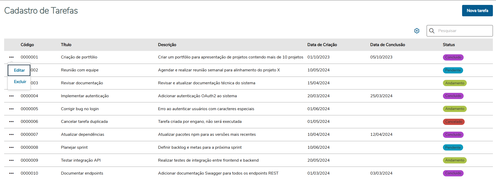

- Confirmação da Exclusão - Tarefa
  - 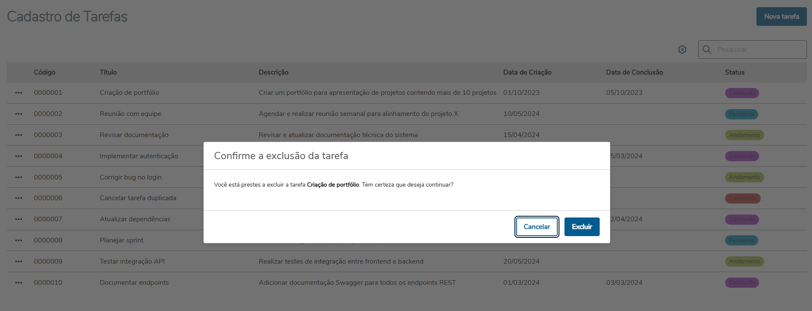

- Operação de Editar - Subtarefa
  - 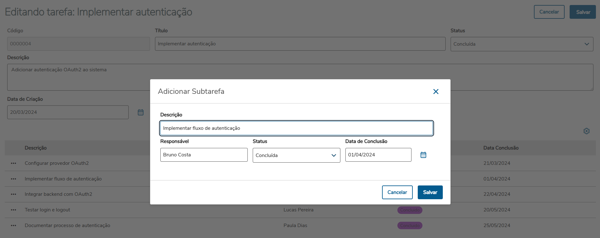

- Confirmação de Exclusão - Subtarefa
  - 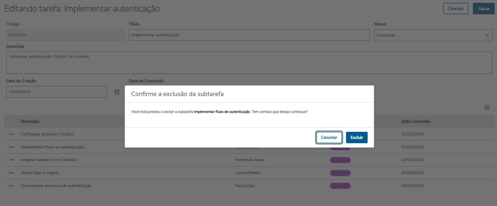

## Pontos importantes
O que iremos avaliar:

- **Geral**: Consideraremos cada Commit feito dentro do repositório, ou seja, incentivamos ao desenvolvedor fazer quantos commits forem necessários. Tambem incentivamos que deixe comentários nos fontes, mesmo que não esteja perfeito, com os comentários poderemos entender qual a intenção. 
- **Projeto funcional**: Iremos compilar os fontes e realizar as operações de CRUD, tanto no Protheus quanto na Interface Web. 
- **Banco de dados**: A modelagem dos dados e a estrutura montada pelo desenvolvedor. X3_VALID, X3_RELACAO, X3_CBOX e etcs serão avaliados.
- **Protheus**: As validações do MVC serão analisadas sintaticamente e testadas, assim como as operações de CRUD;
- **Interface WEB**: As operações de CRUD serão validadas bem como o preenchimento dos campos. Rotas, opções e validação em tela serão consideradas.

- **Organização do repositório**
  - Não altere os arquivos que estão na pasta `assets`;
  - Na pasta `frontend` deixe somente o que for pertinente à interface web;
  - Na pasta `backend` deixe o fonte .prw que criou, ele está intencionalmente vazio para que possa colocar o que entende;
  - Na pasta `database` inclua um .csv com as linhas criadas no SX2 e SX3 para avaliarmos. Caso ache necessário, coloque prints nessa pasta para demonstrar os dados no banco;

### Observações:
- O Exemplo dado da interface web é um exemplo, não necessariamente esperamos que monte como mostrado. Dito isso levaremos em conta o "arranjo" dos componentes em tela, bem como os componentes usado.

### Links uteis

- [FWRestModel](https://tdn.totvs.com/display/public/PROT/FWRestModel)
- [MVC - Protheus](https://tdn.totvs.com/pages/releaseview.action?pageId=28574107)
- [PO-UI](https://po-ui.io)